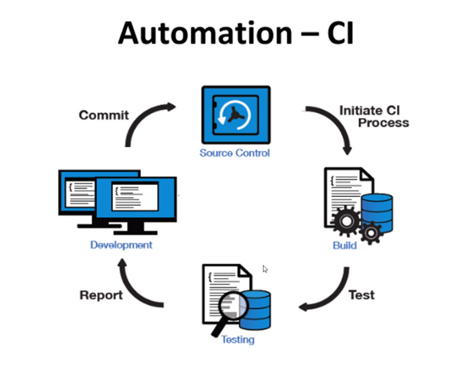

# UNDERSTANDING OF CD/CI
yes
### DEVOPS LIFECYLE
A Continuous Cycle of:
- `Plan` - `Code` - `Build` - `Test` - `Release` - `Deploy` - `Operate` - `Monitor`

## DEVOPS LIFECYLE STAGES
```
- Continuous Development
- Continuous Testing
- Continuous Integration
- Continuous Delivery/Deployment
- Continuous Monitoring
- Continuous Operation
```


### Continuous Integration
The practice of merging all developers working copies to a shared mainline serval times a day to a shared repository
- Development
- Testing
- Integration

### Automation - CI



### Continuous Delivery VS Deployment
- Continuous Delivery: The deployment is `not` live and releasing of software is done manually
- Continuous Deployment: The delivery of frequently deployments to a `live` production environment through automated deployments

#### Why if CD/CI necessary and beneficial?
1. Reduces Cost,
2. Faster Release rate,
3. Smaller code changes,
4. Fault isolations,
5. More tests reliability,
6. Easy maintenance and updates


### What is a CD CI Pipeling?
``` A CD/CD pipeline main purpose is for the automation and integration, testing and deploying software to a production environment. It initialize of code builds, automates testing and automates deployments, which time effective and decreases human errors in testing and deploying as  well as outputs any stages failures.

Some CICD Tools are Open Source(Free and available to the public to use) such as Jenkins. While other might require an up front cost or subscription based payment, like; Team City or GitLab.
```

```
On LocalHost:
- Private ssh key available
- Source code available in Git

On GitHub:
- Key.pub
- Generate another public/private key pay and put public key {ssh-keygen -t rsa -b 4096 -C "{Github email}"}
  - Public key (key.pub) on GitHub repository
  - private Key on Jenkins
```

```
Jenkins Commands
su - root
  ls
  rm -rf Jenkins_CDCI
  git clone https://github.com/JAlexander22/Jenkins_CDCI.git
  cd Jenkins_CDCI
  ls
  chmod 777 provision.sh
  ./provision.sh
  cd app
  npm install
  ```
